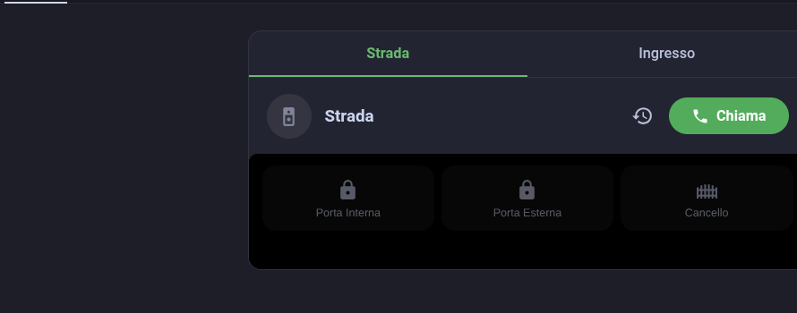
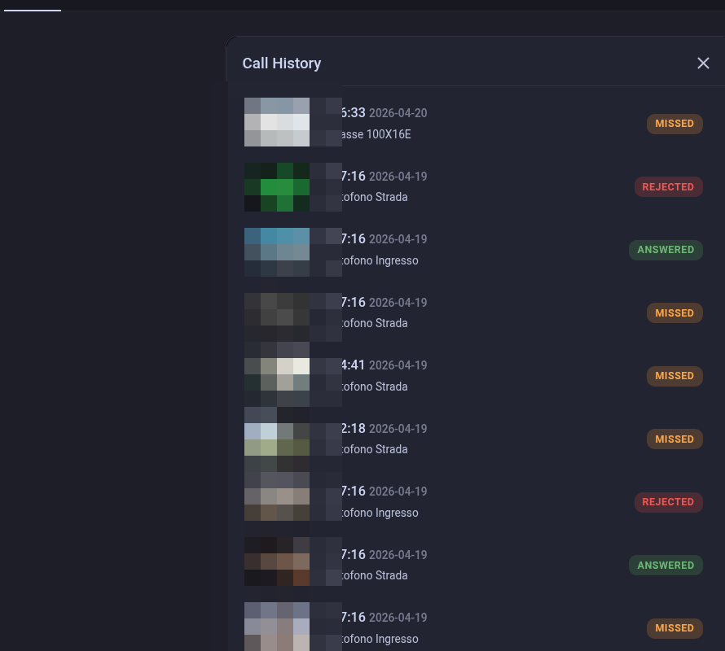

# BTicino Intercom Card

[](https://github.com/hacs/integration)
[](https://github.com/k-the-hidden-hero/bticino_ha_extras/releases/latest)
[](https://github.com/k-the-hidden-hero/bticino_ha_extras/actions/workflows/lint.yaml)
[](https://github.com/k-the-hidden-hero/bticino_intercom/issues)
[](LICENSE)

Custom Lovelace card and companion resources for the [BTicino Intercom](https://github.com/k-the-hidden-hero/bticino_intercom) Home Assistant integration. Live WebRTC video with two-way audio, call history, multi-intercom support, and incoming call notifications.

## What's Included

### Blueprints

| Blueprint | Description |
|-----------|-------------|
| **Intercom Notification** | Urgent push notification when the doorbell rings, with live snapshot preview and actionable buttons: *Answer*, *Open Door*, *Reject* |

### Lovelace Cards

| Card | Description |
|------|-------------|
| **BTicino Intercom Card** | Compact intercom card with live WebRTC video, two-way audio, multi-intercom tabs, call history, and incoming call notifications with ringtone. |





## Installation

### HACS (Recommended)

> **Prerequisites:** You need [HACS](https://hacs.xyz/) installed in your Home Assistant. If you don't have it yet, follow the [HACS installation guide](https://hacs.xyz/docs/use/download/download/) first.

**Step 1 — Add the repository to HACS:**

[](https://my.home-assistant.io/redirect/hacs_repository/?owner=k-the-hidden-hero&repository=bticino_ha_extras&category=plugin)

Click the button above to add the repository. If the button doesn't work, add it manually:

1. Open **HACS** > **Frontend** > click the **three-dot menu** (top right) > **Custom repositories**
2. Paste `https://github.com/k-the-hidden-hero/bticino_ha_extras` as the URL
3. Select **Dashboard** as the category and click **Add**

**Step 2 — Download the card:**

1. In HACS, find **BTicino Intercom Card** in the Frontend list (search if needed)
2. Click on it, then click **Download** (bottom right)
3. Select the latest version (enable **"Show beta versions"** for RC releases) and confirm
4. **Restart Home Assistant**

The card resource is registered automatically by HACS. No manual resource setup needed.

### Manual

Copy `dist/bticino-intercom-card.js` to your `config/www/` directory, then add it as a dashboard resource:

1. Go to **Settings > Dashboards > Resources**
2. Click **Add Resource**
3. URL: `/local/bticino-intercom-card.js`
4. Type: **JavaScript Module**
5. Click **Create**
6. Hard-refresh the browser (`Ctrl+Shift+R`)

## Requirements

- [BTicino Intercom](https://github.com/k-the-hidden-hero/bticino_intercom) integration (v1.9.6+ for notifications, v2.0+ for WebRTC video)
- Home Assistant Companion App (for push notifications)

## Usage

### BTicino Intercom Card

Add the card to any dashboard:

```yaml
type: custom:bticino-intercom-card
intercoms:
  - name: Front Door
    camera: camera.bticino_intercom_front_door
    actions:
      - entity: lock.front_gate
        service: lock.unlock
      - entity: lock.main_door
        service: lock.unlock
  - name: Side Entrance
    camera: camera.bticino_intercom_side_entrance
    actions:
      - entity: lock.side_gate
        service: lock.unlock
```

**Configuration options:**

| Option | Required | Description |
|--------|----------|-------------|
| `intercoms` | Yes | Array of intercom configurations |
| `intercoms[].name` | Yes | Display name for the intercom tab |
| `intercoms[].camera` | Yes | Camera entity from the BTicino Intercom integration |
| `intercoms[].actions` | No | Quick action buttons (entity + service) |
| `max_actions` | No | Max visible actions before overflow menu (default: 4) |
| `auto_mic` | No | Auto-enable microphone on call start (default: true) |

**Features:**

- **Compact idle** -- minimal footprint with intercom name and "Chiama" button
- **Multi-intercom tabs** -- switch between intercoms via tabs or swipe
- **Live video** -- WebRTC with real audio (Chrome/Chromium only)
- **Two-way audio** -- microphone toggle for talking to visitors
- **Call history** -- browse past calls with snapshots
- **Incoming call** -- ringtone, snapshot preview, Answer/Open/Reject actions
- **Quick actions** -- open doors, toggle lights while on a call

### Intercom Notification Blueprint

1. Go to **Settings → Automations & Scenes → Blueprints**
2. Find "BTicino Intercom Notification"
3. Click **Create Automation**
4. Configure:
   - **Notify targets**: Select your mobile devices
   - **Door lock**: Choose which lock to open (porta esterna / interna)
   - **Camera**: Select the live video camera entity (optional, for "Answer" action)
5. Save

When the doorbell rings:
- You'll receive an urgent notification (bypasses Do Not Disturb)
- If a snapshot is available, the notification updates with a preview image
- Tap **Answer** to open the live video stream
- Tap **Open Door** to unlock without answering
- Tap **Reject** to dismiss

## v2.0 Beta Testing

The custom card is a key part of the v2.0 beta. Here's how to set up for testing.

### Quick setup

1. Download `bticino-intercom-card.js` from the [latest release](https://github.com/k-the-hidden-hero/bticino_ha_extras/releases)
2. Copy to your HA `config/www/` directory
3. Add as a resource: **Settings > Dashboards > Resources > Add Resource**
   - URL: `/local/bticino-intercom-card.js`
   - Type: **JavaScript Module**
4. Hard-refresh the browser (`Ctrl+Shift+R`) to clear cache
5. Add the card to your dashboard (see example below)

### Dashboard example

```yaml
type: custom:bticino-intercom-card
intercoms:
  - name: Citofono
    camera: camera.bticino_intercom_front_door
    actions:
      - entity: lock.front_gate
        service: lock.unlock
      - entity: lock.main_door
        service: lock.unlock
```

### Browser compatibility

| Browser | Status | Notes |
|---|---|---|
| Chrome / Chromium | Supported | Full video + two-way audio |
| Edge (Chromium) | Supported | Full video + two-way audio |
| HA Companion (Android) | Supported | Uses Chromium WebView |
| Safari / iOS | Not supported | Device firmware limitation (hardcoded Chrome RTP payload types) |
| Firefox | Not supported | Same device firmware limitation |
| HA Companion (iOS) | Not supported | Uses WebKit (same as Safari) |

> [!IMPORTANT]
> **Do NOT use AlexxIT's WebRTC integration** or other third-party WebRTC players to display the BTicino camera. They are not compatible with the BTicino signaling protocol and cause `InvalidStateError` crashes, especially on iOS/WebKit. This card is specifically designed for the BTicino intercom's WebRTC implementation.

> [!NOTE]
> The browser limitation is a BTicino device firmware issue (BNC1 hardcodes Chrome/libwebrtc RTP payload types regardless of SDP negotiation). The official Netatmo app works on all platforms because it bundles the same `libwebrtc` engine as Chrome. See the [Firefox investigation](https://github.com/k-the-hidden-hero/bticino_intercom/blob/main/docs/firefox-webrtc-investigation.md) for the full analysis.

### Updating the card

When a new version is released:
1. Download the new `bticino-intercom-card.js`
2. Replace the file in `config/www/`
3. Hard-refresh the browser (`Ctrl+Shift+R`) — this is required to clear the cached version

### Reporting issues

Please open issues on the [bticino_intercom](https://github.com/k-the-hidden-hero/bticino_intercom/issues) repository (not here) with:
- Your HA version, browser, integration version
- The browser console log (F12 > Console) if applicable
- Steps to reproduce

## Related Projects

- [bticino_intercom](https://github.com/k-the-hidden-hero/bticino_intercom) — Home Assistant custom integration for BTicino Classe 100X/300X
- [pybticino](https://github.com/k-the-hidden-hero/pybticino) — Python library for the BTicino/Netatmo API

## License

MIT
